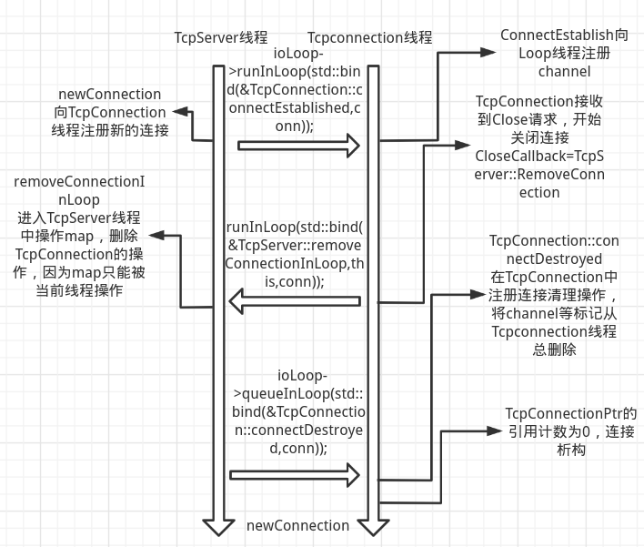
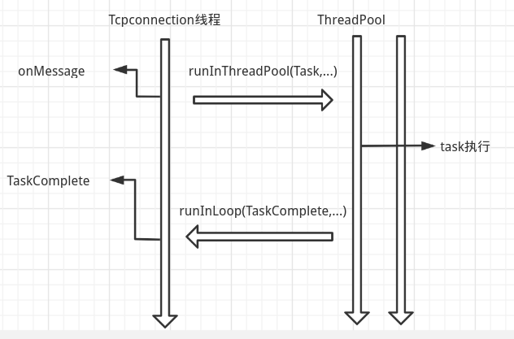

# 简单web服务器
通读并注释了muduo核心代码,在此基础上运行了简单的web服务器,并进行压力测试

# 并发模式
  - TcpServer的EventLoop负责接受连接请求(Acceptor)
  - 使用EventLoopThreadPool线程池处理建立的每个连接,TcpServer线程会将Tcpconnection的处理工作(onMessage,send)分发给线程池中的一个EventLoopThread执行
  
# 相关技术点总结
- EventLoop 在单个线程内提供I/O事件的注册与回调,task注册(runInLoop,queueLoop),定时任务注册
- 每个连接中请求的处理使用Epoll水平触发,Acceptor主线程采用Epoll在水平触发的基础上循环Accept直到接受缓冲区清空,非阻塞I/O,Reactor,one loop per thread
- 基于(set)红黑树与timefd的EventLoop定时器
- 基于timingwheel关闭空闲连接
- EventLoop的task队列使用eventfd来实现异步唤醒EventLoop
- 多线程发挥多核cpu的优势,让Acceptor的I/O操作与TcpConnection的I/O操作在不同的线程中并行运行
- 4缓冲异步日志,日志系统实现前后端,可以自由选择后端的输出函数,异步日志系统不会阻塞主线程
- TcpServer的EventLoop与EventLoopThread之间使用task任务队列来向其他线程分派任务,并以此避免多线程下的对象访问的出现的锁争用,一个tcpconnection的发送和接收操作只会在该conn所在的线程执行
- TcpConnection的建立与析构过程就需要TcpServer Eventloop与线程池中EventLoop之间相互协调

- 对于一些需要大量计算的连接,为了避免计算操作导致降低I/O响应速度,我们可以使用线程池来执行计算任务,当任务执行完毕再使用runInLoop在TcpConnection中回调TaskComplete函数

- http请求解析以行为单位解析,每当接受缓冲区接收到一行数据,就根据HttpContext的当前状态进行对应行的解析,将解析结果保存在HttpRequest中,解析完毕后调用onRequest,通过header中的Connection来决定是否在onRequest函数中执行shutdown

# 测试
[测试](https://github.com/yszc-wy/learn_np/blob/master/server/test.md)
